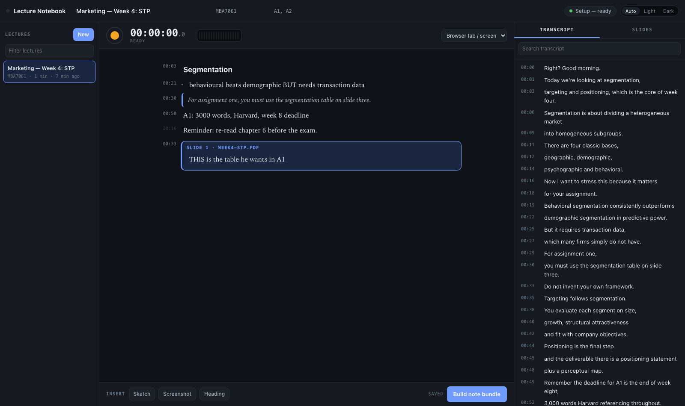

# Lecture Notebook

Take notes while the lecture is being recorded, then hand the whole thing to
Claude and get a proper lecture note back.

Type, sketch, paste screenshots, and draw on the lecturer's slides. Everything
you write is stamped against the recording, so the export knows **what the
lecturer was saying at the moment you wrote it**. Transcription runs locally
with whisper.cpp — no lecture audio leaves the machine.

While the lecture is running, the app does one thing only: get the audio onto
disk. **Transcription happens afterwards, in the background**, with a model
chosen for accuracy rather than speed. You can stop a recording and immediately
start the next lecture; the queue works through them on its own, and survives
the app being closed.



## Installation

The app is a single Node process with **no npm dependencies and no build
step**. It runs on macOS only, because audio capture uses ffmpeg's
`avfoundation` input and the Setup panel installs tools through Homebrew.

**1. Prerequisites**

| Need | Why | Install |
|------|-----|---------|
| Node.js ≥ 18 | runs the server | `brew install node` or [nodejs.org](https://nodejs.org) |
| Homebrew | the Setup panel uses it to install the tools below | [brew.sh](https://brew.sh) |
| Google Chrome | the *Browser tab / screen* source needs Chrome's tab-audio picker | [google.com/chrome](https://www.google.com/chrome/) |

**2. Command-line tools**

```bash
brew install ffmpeg whisper-cpp          # required
brew install poppler                     # optional: renders slide decks
brew install --cask libreoffice          # optional: .ppt/.pptx → PDF
brew install --cask blackhole-2ch        # optional: record Teams/Zoom desktop apps
```

| Tool | For | Required? |
|------|-----|-----------|
| ffmpeg | recording | **yes** |
| whisper-cpp | transcription (`whisper-cli`) | **yes** |
| poppler | PDF → page images and text | no — without it you can still record and take notes, just not add slides |
| LibreOffice | converting PowerPoint to PDF | no — PDFs work without it |
| BlackHole | a loopback audio device | no — only for the Teams/Zoom *desktop* apps; a lecture in a Chrome tab needs nothing |

You can skip this step: the Setup panel in the app shows what is missing and
has an **Install** button for whisper-cpp and poppler.

**3. Get the code and run it**

```bash
git clone https://github.com/jan1tha/lecture-notebook.git
cd lecture-notebook
npm start                                # http://localhost:4210
```

`PORT=5000 npm start` picks another port. The server binds to `127.0.0.1`
only — it is never reachable from another machine.

The first start creates `data/` beside the code. Everything you record and
write lives there, and it is gitignored. Back that folder up, not the repo.

**4. Check it is working**

Open [http://localhost:4210](http://localhost:4210). The chip in the top-right
corner says **Setup — ready** when ffmpeg, whisper and at least one model are
in place. If it says anything else, click it: the panel lists each tool with
its status and a one-line fix.

## Setup

Click the **Setup** chip in the top-right corner. Everything below is in that
panel; nothing needs editing by hand.

**Download a transcription model.** whisper.cpp needs a model file, and none
ships with the app. The panel lists them with their sizes and the free space on
your disk. Press **Download** next to **Large v3 Turbo** (1.6 GB) — it is the
default, and the one to start with. A stopped download can be resumed. See
[Choosing a model](#choosing-a-model) for the trade-offs.

Models go in `models/` inside the repo, unless either of these exists first:

| Location | When |
|----------|------|
| `$MODELS_DIR` | you set the environment variable |
| `../audio-scribe/models` | you also have [Audio Scribe](../audio-scribe) checked out next to this repo — the two apps share one download |

**Pick the audio source.** The dropdown on the transport (next to the clock)
has two kinds of input:

- **Browser tab / screen** — for a lecture on Teams, Meet or Zoom in a Chrome
  tab, or a recorded lecture on YouTube. When Chrome asks what to share, pick
  the tab and tick **Also share tab audio**. No extra setup.
- **Audio input device** — your microphone, for an in-person lecture. To record
  the Teams or Zoom *desktop* apps instead, install BlackHole (command above),
  then in **System Settings → Privacy & Security** approve the driver when
  macOS asks. The Setup panel's **System audio** card goes green once it sees
  the device.

**Grant macOS permissions.** The first device recording makes macOS ask for
microphone access for your terminal (or whatever launched `node`). If the meter
stays flat, check **System Settings → Privacy & Security → Microphone**. Chrome
asks for its own screen-and-tab permission the first time you share a tab.

**Optional settings in the panel:**

- **Also show a rough live transcript while recording** — off by default. It
  streams a rough transcript during the lecture using a small model, at the
  cost of CPU during the one part of the session that must not glitch. The
  transcript you keep is the background one either way.
- **Live preview model** — only used when the above is on. `base.en` is fine.

**Settings with no UI.** A handful of knobs live in `data/settings.json` and
can be changed with a POST to `/api/settings`; the defaults are right for
almost everyone.

```bash
curl -X POST localhost:4210/api/settings \
  -H 'content-type: application/json' \
  -d '{"notesDir":"/Users/you/Documents/MBA/Notes"}'
```

| Key | Default | What it does |
|-----|---------|--------------|
| `notesDir` | `~/Documents/Personal/MBA/Notes` in the prompt | where the generated prompt tells Claude to write the finished note (absolute path, no `~`) |
| `language` | `auto` | force a transcription language, e.g. `en` |
| `backgroundThreads` | `0` (half the cores) | CPU given to background transcription |
| `stallSeconds` | `12` | how long with no audio before capture is restarted |
| `keepPcm` | `false` | keep the raw PCM after transcription (~115 MB/hour) |
| `slideDpi` | `140` | resolution slide pages are rendered at |

**For the last step — turning a bundle into a note —** you need Claude Code
with the `mba-lecture-notes` skill installed at
`~/.claude/skills/mba-lecture-notes/`. The app does not need it to run; it only
affects what you do with the exported folder.

## Using it

**Make a module first.** Hit **Module** and name the subject — *Strategic
Management*, say. A module holds its lectures, its lecturer, its assessments
(`A1, A2`) and a colour, plus its own **module notes**: the reading list, the
framework you keep forgetting, the question you want to ask next week. Anything
that is true all term rather than in one lecture belongs there.

Those module notes are not just for you. Every bundle you build from a lecture
in that module carries them along as reference material, so the note generator
knows what you already know and what you have flagged for the assessments.

**Then a lecture.** **+ Lecture** inside a module, or the **Lecture** button and
pick the module from the dropdown in the header. A lecture inherits the module's
lecturer and assessments.

**Record.** Press the record button when the lecturer starts.
- *Browser tab / screen* — for a lecture on Teams, Meet or Zoom in a Chrome tab,
  or a recorded lecture on YouTube. Tick **"Also share tab audio"** in Chrome's
  picker.
- *Audio input device* — for an in-person lecture, pick your microphone. To
  capture the Teams or Zoom desktop apps you need a loopback device
  (`brew install --cask blackhole-2ch`).

Press **Stop** when it ends. The audio is saved immediately and the lecture
joins the transcription queue — the chip in the top bar shows what is running
and roughly how long is left. When it finishes, the transcript appears on the
right; click any line to quote it into your notes at that timestamp.

If you want a rough transcript scrolling past *during* the lecture, turn on
**"Also show a rough live transcript while recording"** in Setup. It costs CPU
during the one part of the session that matters, and the transcript you keep is
the background one either way.

**Take notes.** The middle column is the notebook. Each block carries the time
it was written, shown in the left gutter — click a timestamp to jump the
transcript to that moment.

Type `/` for the full list of block types. The shortcuts are worth learning,
because in a lecture you have one hand free:

| Type this | Or press | And you get |
|-----------|----------|-------------|
| `# ` `## ` `### ` | ⌘1 ⌘2 ⌘3 | Headings |
| `- ` | ⌘⇧8 | A bullet |
| `1. ` | ⌘⇧7 | A numbered point |
| `[] ` | ⌘⇧9 | A to-do — something to look up later |
| `> ` | ⌘⇧K | A quote |
| `!! ` | ⌘⇧E | **An exam hint** |
| `---` | | A divider |
| | Tab / ⇧Tab | Indent, and out again |
| | ⌥↑ / ⌥↓ | Move the block |
| | ⌘⏎ | Tick a to-do off |
| | ⌘B / ⌘I | Bold, italic |

**Exam hints are the ones that pay off.** When the lecturer says "this is what
I'm looking for in A1", flag the line with `!! `. It goes into the bundle as a
marked hint, and the note generator is told to pull every one of them into the
assignment section, with what was being said at that moment. An unticked to-do
travels too — it tells the generator you didn't follow something, so it explains
it rather than repeating it back.

Also:
- **Paste** a screenshot straight in (⌘V), or drag an image onto the page
- **Sketch** opens a drawing pad; save it and it becomes a block
- **Outline** jumps between your headings
- Blocks written before or after the recording are marked as such
- Notes autosave, keep a local copy if the network drops, and flush on the way
  out — closing the laptop mid-sentence does not cost you the paragraph

**Add the slides.** On the **Slides** tab, add the lecturer's PDF or PowerPoint.
Pages render so you can:
- **Draw** on them — your ink is saved per page
- **Note on this slide** — drops a block into your notes pinned to that page

The original file is never modified. Annotations live beside it.

**Build the bundle.** Press **Build note bundle**. You get a folder and a prompt
to paste into Claude Code:

```
/mba-lecture-notes
Materials: …/data/sessions/<id>/export  (read MANIFEST.md first)
Output: ~/Documents/Personal/MBA/Notes/Marketing-Week-4-STP.md
```

That's the "give it a session ID and get a proper note" step.

## What the bundle contains

```
MANIFEST.md              what everything is, written for the skill
transcript.md            raw whisper output, timestamped
my-notes.md              your notes in the order you wrote them
combined-timeline.md     your notes interleaved with the transcript, by time
reference/module-notes.md  your standing notes on the module
session.json             the same data, machine-readable
slides/<deck>.pdf        the original deck (the skill reads it page by page)
slides/annotated/        pages you drew on, ink composited in
images/  sketches/       screenshots and sketches
```

`combined-timeline.md` is the point of the whole thing:

```
**[00:29] 🎙️ LECTURER:** For assignment one,
**[00:30] 🎙️ LECTURER:** you must use the segmentation table on slide three.
**[00:30] 📝 MY NOTE:** > For assignment one, you must use the segmentation table on slide three.
**[00:33] 📝 MY NOTE:** 📌 Slide 1 of Week4-STP.pdf — THIS is the table he wants in A1
```

A three-word note becomes usable because the export knows what was being said
when you wrote it.

## Choosing a model

Because transcription runs after the lecture rather than during it, nothing has
to keep up with the lecturer — so pick for accuracy:

| Model | Size | Worth it? |
|-------|------|-----------|
| **Large v3 Turbo** | 1.6 GB | **Yes.** Near-large accuracy, several times real time. Start here. |
| Large v3 | 3.1 GB | The most accurate. Slow enough to leave running overnight. |
| Medium (English) | 1.5 GB | Excellent English, but roughly real time. |
| Small (English) | 466 MB | The floor for a usable lecture-hall transcript. |
| Base / Tiny | ≤142 MB | Only as the optional live preview. |

Jobs run at low priority on half the cores, so a lecture transcribing in the
background should not make the machine feel slow.

If the model you picked isn't downloaded, the app quietly uses the best one you
do have and says so in the Setup chip.

## Filing a term away

When a module is finished, **Archive** it. Archived lectures and modules drop to
an **Archived** shelf at the bottom of the library, collapsed until you want it.
Nothing is deleted and nothing stops working: the transcript still reads, the
notes still open, the bundle still builds, and a search still finds it — the
library just stops showing last term next to this week.

- **Row hover → ⌸** archives a lecture; **↩** brings it back. Fastest way to
  tidy a whole term.
- **Archive module** asks whether to take its lectures with it.
- Pressing record on an archived lecture simply un-archives it. Filing is not a
  lock.

An archived lecture also offers to **free its audio**. A term of recordings is
several gigabytes of m4a, and once a lecture is transcribed the audio has
usually done its job. This is the one irreversible thing in the app, so it is
never automatic: it only ever touches recordings that already have a transcript,
it leaves untranscribed ones completely alone, and it tells you plainly that the
lecture can never be transcribed again afterwards. Your notes, transcript and
slides are untouched either way.

## Where your recordings live

Each recording is a single **`.m4a`** file (AAC, 16 kHz mono — about 28 MB an
hour), stored next to everything else belonging to that lecture:

```
data/sessions/<lecture id>/recordings/<recording id>/audio.m4a
```

You don't have to go looking. Click the **ⓘ** on a recording chip above the
transcript and you get the exact path, the size and format, a player to scrub
through it, **Copy path**, and **Show in Finder**.

## Timing

Pressing record and audio actually flowing are about **half a second** apart,
almost all of it macOS opening the input device. The app measures that gap
rather than guessing: the ⓘ panel on a recording shows both when you pressed
record and when the first sample landed.

That gap is *not* baked into your notes. Timestamps are anchored to the first
captured sample, so a note stamped 12:34 lines up with what the lecturer was
saying at 12:34 — not half a second earlier.

The ⓘ panel also shows **Audio captured**: how much of the elapsed time made it
into the file. It should be 99-100%. If it is lower, the input was dropping
samples and parts of the lecture are genuinely missing — it shows in red, and
the recording chip says so too.

## When something goes wrong

The recorder is built on the assumption that a two-hour lecture *will* hit
something — the shared tab freezes, the audio device changes, the laptop sleeps.

- **The app tells you when the input is too quiet.** About ten seconds into a
  recording it starts watching the level, and if the audio is audible but too
  faint to transcribe well it puts a warning on the transport with the actual
  figure (`Very quiet · -27 dB`). Move the microphone closer or raise the input
  level — you have the rest of the lecture to fix it.
- **Quiet audio makes whisper repeat itself.** If an old transcript comes back
  as the same sentence over and over, that is why: the model could not find
  words, so it echoed what it just said. The app is now configured to stop that
  happening, but the real fix is at the source.
- If audio stops arriving, the app notices within about 12 seconds, restarts
  capture into the same recording, and tells you. You lose a few seconds at that
  point, not the rest of the lecture — and the export tells the note generator
  exactly where the hole is.
- The timecode shows **how much audio actually exists**, not how long ago you
  pressed record. If those drift apart you get a warning chip rather than a
  healthy-looking clock over a dead microphone.
- If the app or the machine dies mid-lecture, the audio captured so far is still
  on disk. On the next start it is found, marked interrupted and queued for
  transcription automatically.
- Any recording can be transcribed again from the **⟳** button beside it — worth
  doing after you download a better model.

## How it works

The recording engine is forked from [Audio Scribe](../audio-scribe): every
source is normalised to 16 kHz mono PCM, sliced into windows, and fed to
whisper.cpp, with window cuts landing on pauses whisper itself found.

Slides are converted server-side — LibreOffice for PPTX→PDF, poppler for
PDF→PNG per page plus text extraction — so there is no PDF library in the
browser and it all works offline.

```
server.js              HTTP control plane + JSON API (zero dependencies)
lib/session.js         capture: audio onto disk, and nothing else
lib/jobs.js            the background transcription queue
lib/rescan.js          transcribing a recording that already exists
lib/modules.js         modules and module notes
lib/slides.js          deck conversion and page rendering
lib/exporter.js        the bundle builder
lib/store.js           sessions, notebooks, assets
public/editor.js       the block editor (lectures and modules both)
public/sketch.js       the drawing widget (notes + slide ink)
data/sessions/<id>/    everything for one lecture   (gitignored)
data/modules/<id>/     a module and its notes       (gitignored)
```

## Notes

- Notes autosave about a second after you stop typing; ⌘S forces it.
- A lecture can hold several recordings — stop for the break, record again
  after; the timeline merges them.
- Deleting a module never deletes its lectures. They just stop being filed.
- Archiving never deletes anything either — only **Free audio** does, and only
  for recordings that already have a transcript.
- Stopping the server finalises any recording still running, and the queue picks
  up where it left off next time.
